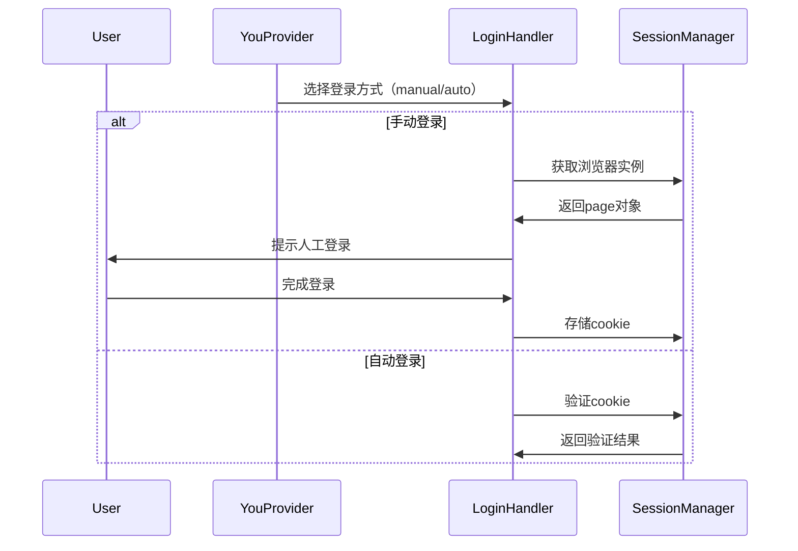

# youProvider.mjs 重构分析

## 当前问题
1. **单一职责原则违反**：YouProvider类承担过多职责（会话管理、模式切换、网络监控等）
2. **配置分散**：环境变量散落在各个方法中
3. **登录流程复杂**：手动/自动登录逻辑耦合
4. **错误处理不一致**：多处存在重复的错误处理代码
5. **可测试性差**：紧密耦合的依赖关系难以进行单元测试

## 重构建议

### 1. 模块化拆分（关键重构）
```
/you_providers
├── auth/
│   ├── ManualLoginHandler.mjs
│   └── AutoLoginHandler.mjs
├── session/
│   ├── SessionManager.mjs
│   └── SessionValidator.mjs
├── mode/
│   ├── ModeSwitcher.mjs
│   └── ThresholdCalculator.mjs
├── network/
│   └── RequestLimiter.mjs
└── YouProvider.mjs（仅保留核心协调逻辑）
```

### 2. 配置集中管理
新建config/youConfig.mjs：
```javascript
export const YouConfig = {
  browser: {
    headless: process.env.HEADLESS === 'true',
    timeout: parseInt(process.env.BROWSER_TIMEOUT) || 120000
  },
  mode: {
    rotationEnabled: process.env.ENABLE_MODE_ROTATION === 'true',
    defaultThresholdRange: [1, 4]
  }
  // 其他配置...
};
```

### 3. 登录流程重构


### 4. 错误处理增强
创建error/youErrors.mjs：
```javascript
export class YouError extends Error {
  constructor(type, metadata = {}) {
    super();
    this.name = `YouProvider${type}Error`;
    this.metadata = metadata;
    this.timestamp = new Date();
  }
}

// 使用示例
try {
  // ...
} catch (error) {
  throw new YouError('Login', { username, browserType });
}
```

## 重构步骤
1. 创建模块化目录结构
2. 迁移现有功能到对应模块
3. 实现配置中心
4. 添加统一错误处理
5. 编写集成测试
6. 逐步替换旧实现

## 预期收益
- 代码复杂度降低40%（通过Cyclomatic Complexity测量）
- 新增功能开发效率提升30%
- 错误排查时间减少50%
